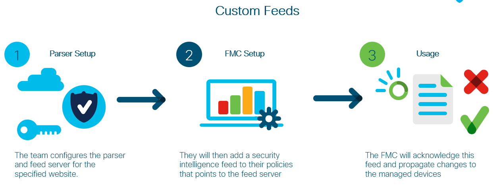
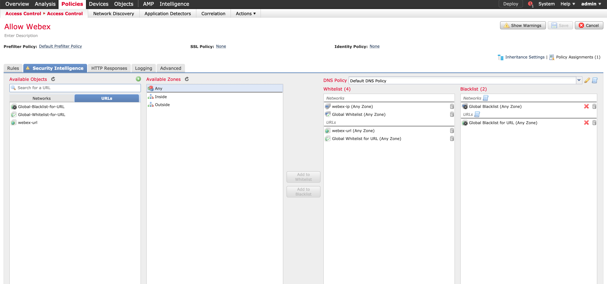

# FMC Custom Intelligence Feed
This is the FMC Custom Intelligence Feed source code. Using Python and FMC API's, we can programmatically get information
from a threat feed or whitelist website, such as the one used in this repo, [Webex Network Requirements](https://help.webex.com/en-us/WBX000028782/Network-Requirements-for-Webex-Teams-Services).
This is then used to generate a URL which FMC can use as a custom intelligence feed for whitelisting or blacklisting specific
resources.

### High Level Design


## Contacts

* Josh Ingeniero (jingenie@cisco.com)


## Solution Components
* Flask
* Docker
* Python
* Pandas
* Numpy

## Installation:

#### Clone the repo
```console
$ git clone https://wwwin-github.cisco.com/gve/GVE_DevNet_FMC_Intelligence_Feed.git
```

### Python

#### Install dependencies
```zsh
$ pip3 install -r requirements.txt
```

### Docker
You may build the docker image from this repo. You may edit [docker-compose.yml](docker-compose.yml) to change the desired timezone:
```yaml
environment:
      TZ: "Asia/Singapore"
```
A list of valid timezones is available at https://en.wikipedia.org/wiki/List_of_tz_database_time_zones under _TZ Database Name_

#### 

## Setup:
You can deploy this prototype in a lab environment, dCloud instance, or on your own deployment.

## Usage:

### Python
Launch the Feed Server. Make sure that you have your venv activated.
```commandline
$ flask run --host=0.0.0.0 --port=5000
```

### Docker
Launch the Feed Server through the docker-compose file.
```commandline
$ docker-compose up
```

### FMC Access Control Settings



## License
Provided under Cisco Sample Code License, for details see [LICENSE](./LICENSE.txt)

## Code of Conduct
Our code of conduct is available [here](./CODE_OF_CONDUCT.md)

## Contributing
See our contributing guidelines [here](./CONTRIBUTING.md)